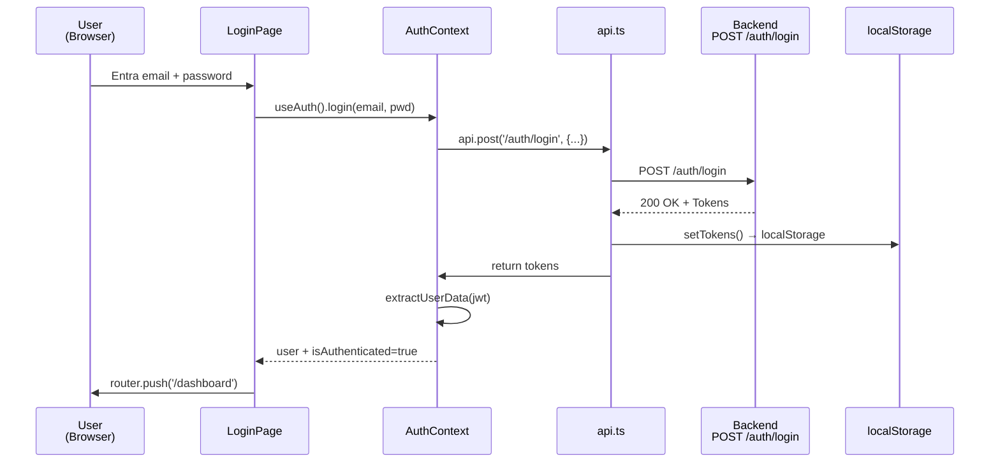
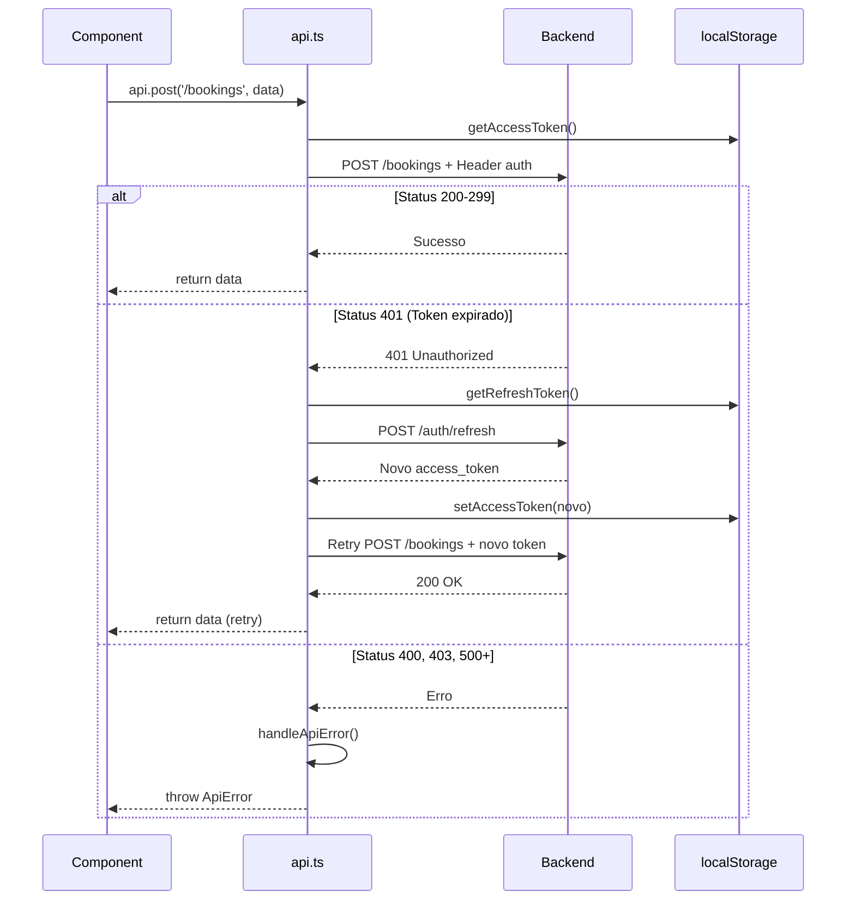
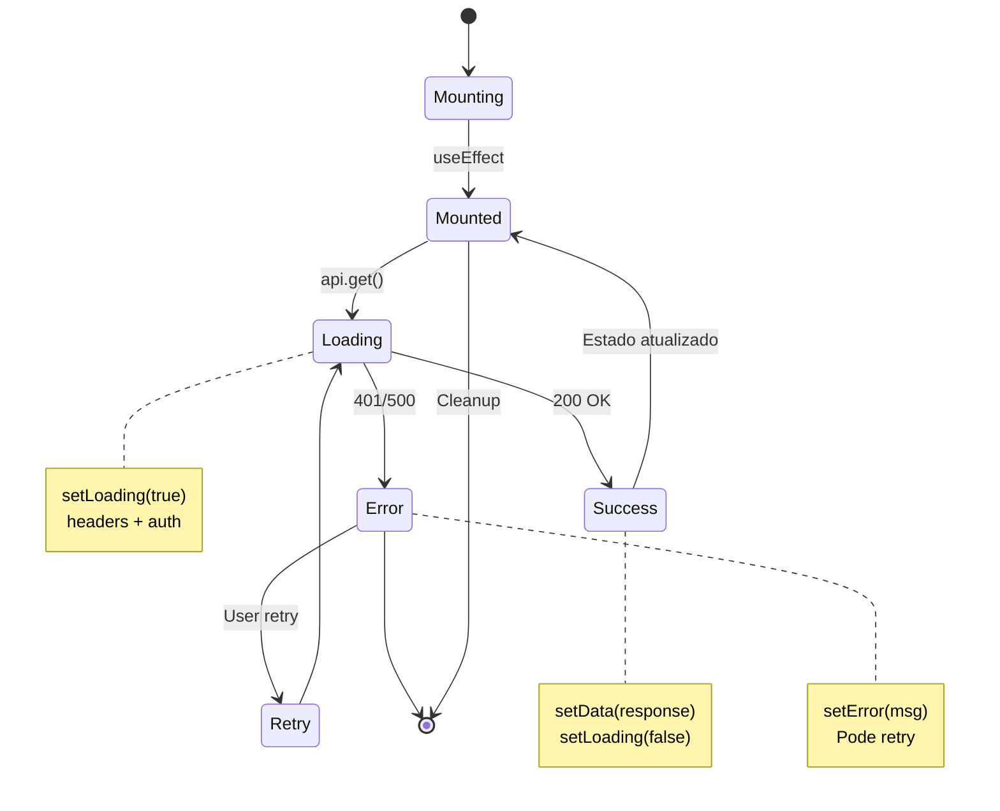
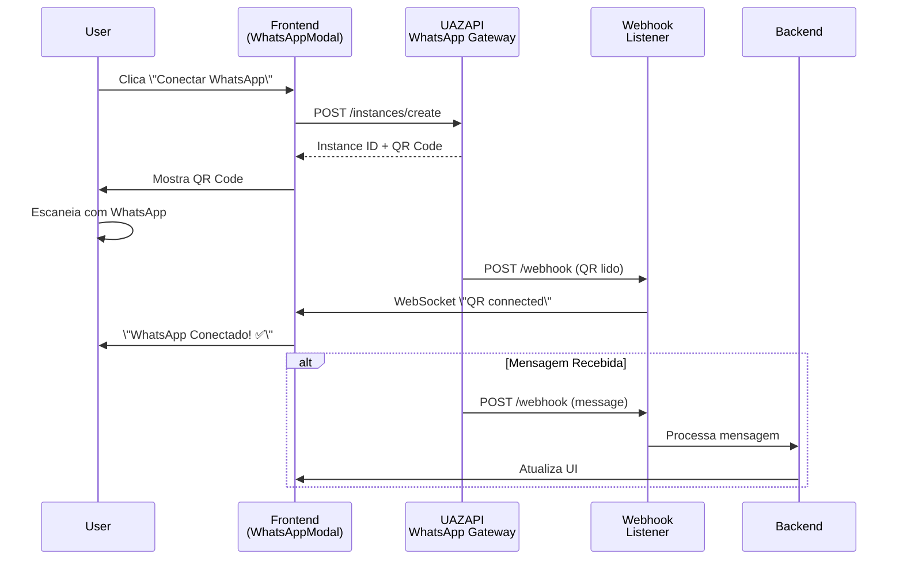
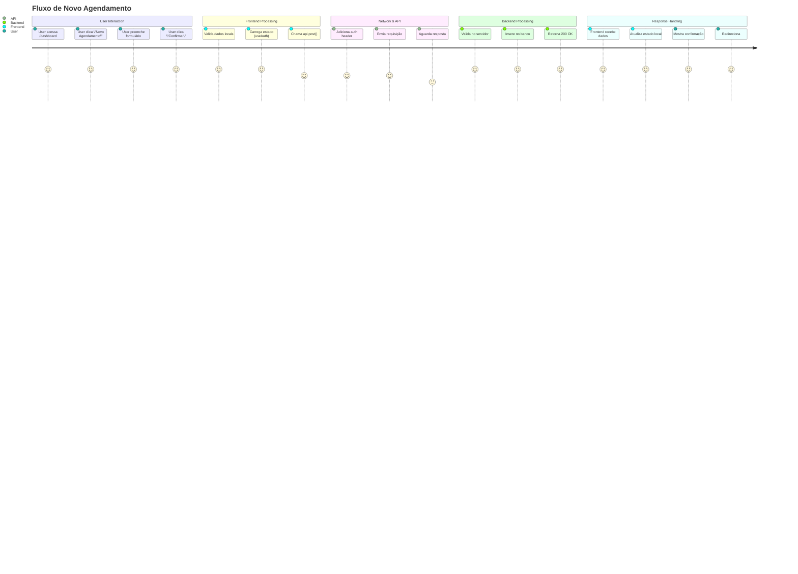

# 📊 Diagramas Visuais da Documentação

> Referência visual com **diagramas Mermaid** para entender melhor a arquitetura do Ritmo Frontend.

---

## 🔐 Fluxo de Autenticação (Login)



---

## 📊 Estado Global (State Management)

```mermaid
graph TD
    App[\"🎯 App Root<br/>(layout.tsx)\"]
    Providers[\"Providers\"]
    ThemeProvider[\"🎨 ThemeProvider\"]
    AuthProvider[\"🔐 AuthProvider\"]
    
    ThemeState[\"Theme State<br/>- theme: light|dark|system<br/>- resolvedTheme: light|dark<br/>- mounted: boolean\"]
    ThemeActions[\"Theme Actions<br/>- setTheme()<br/>- toggleTheme()\"]
    
    AuthState[\"Auth State<br/>- user: User | null<br/>- isLoading: boolean<br/>- error: string | null\"]
    AuthActions[\"Auth Actions<br/>- login()<br/>- logout()\"]
    
    Components[\"📦 Components<br/>(useTheme, useAuth)\"]

    App --> Providers
    Providers --> ThemeProvider
    Providers --> AuthProvider
    
    ThemeProvider --> ThemeState
    ThemeProvider --> ThemeActions
    AuthProvider --> AuthState
    AuthProvider --> AuthActions
    
    ThemeState --> Components
    ThemeActions --> Components
    AuthState --> Components
    AuthActions --> Components

    style App fill:#4a5568,color:#fff
    style Providers fill:#2c3e50,color:#fff
    style ThemeProvider fill:#805ad5,color:#fff
    style AuthProvider fill:#2b6cb0,color:#fff
    style Components fill:#38a169,color:#fff
```

---

## 🌐 Fluxo de Requisição HTTP (Com Auto-Refresh)



---

## 🎨 Fluxo de Tema (Dark Mode)

```mermaid
graph LR
    User[\"User\"] 
    Toggle[\"ThemeToggle<br/>useTheme()\"]
    Context[\"ThemeContext\"]
    Storage[\"localStorage\"]
    DOM[\"DOM<br/>data-theme attr\"]
    CSS[\"CSS Variables<br/>--color-bg-primary\"]
    Component[\"Component<br/>(auto updated)\"]
    
    User -->|Clica| Toggle
    Toggle -->|setTheme('dark')| Context
    Context -->|Salva| Storage
    Context -->|setAttribute| DOM
    DOM -->|CSS selector| CSS
    CSS -->|aplica| Component
    
    style Toggle fill:#805ad5,color:#fff
    style Context fill:#805ad5,color:#fff
    style Storage fill:#2c3e50,color:#fff
    style DOM fill:#2b6cb0,color:#fff
    style CSS fill:#f6ad55,color:#000
    style Component fill:#38a169,color:#fff
```

---

## 🏗️ Arquitetura em Camadas

```mermaid
graph TD
    Browser[\"🌐 Browser<br/>(Next.js App)\"]
    
    Pages[\"📄 Pages<br/>/login, /dashboard, /admin\"]
    Components[\"📦 Components<br/>Button, Input, Modal\"]
    Providers[\"🔗 Providers<br/>AuthProvider, ThemeProvider\"]
    
    LibAPI[\"🔌 lib/api.ts<br/>(HTTP Client)\"]
    LibAuth[\"🔐 lib/auth-context.tsx\"]
    LibTheme[\"🎨 lib/theme-context.tsx\"]
    LibAdmin[\"🛠️ lib/admin-api.ts\"]
    LibUazapi[\"💬 lib/uazapi.ts\"]
    
    CSS[\"🎨 CSS Variables<br/>(Design Tokens)\"]
    
    Backend[\"⚙️ Backend API<br/>localhost:8000\"]
    UAZAPI[\"💬 UAZAPI<br/>WhatsApp Gateway\"]
    
    Browser --> Pages
    Browser --> Components
    Browser --> Providers
    Browser --> CSS
    
    Pages --> LibAPI
    Pages --> LibAuth
    Components --> LibTheme
    Providers --> LibAuth
    Providers --> LibTheme
    
    LibAPI --> Backend
    LibAuth --> LibAPI
    LibAdmin --> LibAPI
    LibUazapi --> UAZAPI
    
    style Browser fill:#2c3e50,color:#fff
    style Pages fill:#2b6cb0,color:#fff
    style Components fill:#38a169,color:#fff
    style Providers fill:#805ad5,color:#fff
    style LibAPI fill:#d69e2e,color:#fff
    style LibAuth fill:#c53030,color:#fff
    style Backend fill:#1a202c,color:#fff
```

---

## 📈 Fluxo de Deploy

```mermaid
graph LR
    Code[\"💻 Código<br/>ritmo-frontend\"] 
    Git[\"🔗 Git Push<br/>GitHub\"]
    CI[\"🤖 GitHub Actions<br/>CI/CD\"]
    Build[\"🏗️ npm run build<br/>.next/ gerado\"]
    
    Test{\"✅ Testes<br/>passaram?\"}
    
    Deploy[\"🚀 Deploy<br/>Vercel/AWS\"]
    Prod[\"📦 Produção<br/>LIVE\"]
    
    Code -->|git push| Git
    Git -->|trigger| CI
    CI -->|run| Build
    Build -->|eslint, tsc| Test
    
    Test -->|Sim| Deploy
    Test -->|Não| Code
    
    Deploy -->|live| Prod
    
    style Code fill:#2b6cb0,color:#fff
    style Git fill:#2c3e50,color:#fff
    style CI fill:#805ad5,color:#fff
    style Build fill:#d69e2e,color:#fff
    style Test fill:#f6ad55,color:#000
    style Deploy fill:#38a169,color:#fff
    style Prod fill:#22863a,color:#fff
```

---

## 🔄 Ciclo de Vida de Componente com API



---

## 🎯 Estrutura de Navegação (App Router)

```mermaid
graph TD
    App[\"App Root<br/>(layout.tsx)\"]
    Public[\"Públicas<br/>(sem auth)\"]
    Protected[\"Protegidas<br/>(com auth)\"]
    
    Landing[\"/ - Landing<br/>Demo cards\"]
    Login[\"📍 /login<br/>LoginForm\"]
    Register[\"📍 /register<br/>SignupForm\"]
    Terms[\"📍 /terms-of-service\"]
    
    Dashboard[\"🔒 /dashboard<br/>Dashboard layout\"]
    Schedule[\"📍 /dashboard/schedule<br/>Schedule mgmt\"]
    Clients[\"📍 /dashboard/clients<br/>Client mgmt\"]
    
    Admin[\"🔒 /admin<br/>Admin layout\"]
    Tenants[\"📍 /admin/tenants<br/>Company mgmt\"]
    Users[\"📍 /admin/users<br/>User mgmt\"]
    
    App --> Public
    App --> Protected
    
    Public --> Landing
    Public --> Login
    Public --> Register
    Public --> Terms
    
    Protected --> Dashboard
    Dashboard --> Schedule
    Dashboard --> Clients
    
    Protected --> Admin
    Admin --> Tenants
    Admin --> Users
    
    style App fill:#2c3e50,color:#fff
    style Public fill:#2b6cb0,color:#fff
    style Protected fill:#c53030,color:#fff
    style Dashboard fill:#38a169,color:#fff
    style Admin fill:#805ad5,color:#fff
```

---

## 📱 Fluxo WhatsApp (UAZAPI)



---

## 🎯 Exemplo: Ciclo Completo de um Agendamento



---

## 📊 Comparação: Com vs Sem Auto-Refresh

```mermaid
flowchart TD
    A[\"Request com token expirado\"] --> B{\"Implementação?\"}
    
    B -->|Sem Auto-Refresh| C[\"❌ Response 401\"]
    C --> D[\"❌ User vê erro\"]
    D --> E[\"❌ Redireciona login\"]
    E --> F[\"❌ Experiência ruim\"]
    
    B -->|Com Auto-Refresh| G[\"✅ Response 401 detectado\"]
    G --> H[\"✅ Refresh token automaticamente\"]
    H --> I[\"✅ Retry requisição original\"]
    I --> J[\"✅ Response 200 OK\"]
    J --> K[\"✅ User não percebe nada\"]
    
    style F fill:#c53030,color:#fff
    style K fill:#22863a,color:#fff
```

---

**Todos esses diagramas podem ser visualizados e editados em:**
- VS Code com extensão Markdown Preview Mermaid
- GitHub (suporta Mermaid nativamente)
- Online em [mermaid.live](https://mermaid.live)

Os diagramas **ASCII** estão incluídos como fallback nos arquivos de documentação!
"