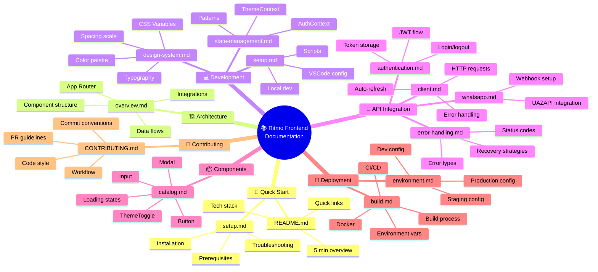

# 🗺️ Mapa de Navegação da Documentação

## Diagrama Visual



---

## 🎯 Rotas Recomendadas por Perfil

### 👨‍💻 Novo Desenvolvedor
```
1. README.md (2 min)
   ↓
2. docs/development/setup.md (5 min)
   ↓
3. docs/architecture/overview.md (10 min)
   ↓
4. docs/development/design-system.md (5 min)
   ↓
5. docs/components/catalog.md (5 min)
   ↓
6. CONTRIBUTING.md (5 min)
```
**Total: ~30 minutos para estar pronto**

---

### 🔧 Desenvolvedor Precisando Integrar com API
```
1. docs/api/client.md (10 min)
   ↓
2. docs/api/authentication.md (5 min)
   ↓
3. docs/api/error-handling.md (5 min)
   ↓
4. docs/api/whatsapp.md (5 min - se precisar de WhatsApp)
```
**Total: ~15-20 minutos**

---

### 🚀 Desenvolvedor Preparando Deploy
```
1. docs/deployment/environment.md (5 min)
   ↓
2. docs/deployment/build.md (15 min)
   ↓
3. Executar checklist em build.md
```
**Total: ~20 minutos + build time**

---

### 🎨 Designer/Contribuidor UI
```
1. docs/development/design-system.md (10 min)
   ↓
2. docs/components/catalog.md (10 min)
   ↓
3. CONTRIBUTING.md (5 min)
```
**Total: ~25 minutos**

---

### 🏢 Product Manager / Stakeholder
```
1. README.md (2 min)
   ↓
2. docs/architecture/overview.md (10 min - skip code)
```
**Total: ~12 minutos**

---

## 📚 Índice Rápido

| Documento | Tempo | Público | Propósito |
|-----------|-------|---------|----------|
| [README.md](../README.md) | 2 min | Todos | Visão geral do projeto |
| [docs/README.md](./README.md) | 5 min | Devs | Índice de docs |
| [setup.md](./development/setup.md) | 5 min | Novo dev | Setup local |
| [overview.md](./architecture/overview.md) | 10 min | Todos | Arquitetura |
| [design-system.md](./development/design-system.md) | 5 min | Designers | CSS/Design |
| [state-management.md](./development/state-management.md) | 5 min | Devs | Context API |
| [catalog.md](./components/catalog.md) | 5 min | Devs | Componentes |
| [client.md](./api/client.md) | 10 min | Devs | HTTP Client |
| [authentication.md](./api/authentication.md) | 5 min | Devs | JWT/Login |
| [whatsapp.md](./api/whatsapp.md) | 5 min | Devs | WhatsApp |
| [error-handling.md](./api/error-handling.md) | 5 min | Devs | Erros |
| [build.md](./deployment/build.md) | 15 min | Devs/DevOps | Deploy |
| [environment.md](./deployment/environment.md) | 3 min | Devs/DevOps | Env vars |
| [CONTRIBUTING.md](../CONTRIBUTING.md) | 5 min | Contribuidores | Regras de contribuição |

---

## 🔍 Busca por Tópico

### Autenticação & Segurança
- [docs/api/authentication.md](./api/authentication.md) - JWT, login, refresh
- [docs/development/state-management.md](./development/state-management.md) - AuthContext
- [docs/api/error-handling.md](./api/error-handling.md) - 401/403 handling

### Estilos & Design
- [docs/development/design-system.md](./development/design-system.md) - CSS Variables
- [docs/components/catalog.md](./components/catalog.md) - Componentes
- CONTRIBUTING.md - Code style

### Integração com Backend
- [docs/api/client.md](./api/client.md) - HTTP Client
- [docs/api/authentication.md](./api/authentication.md) - Login
- [docs/api/error-handling.md](./api/error-handling.md) - Erros

### WhatsApp / UAZAPI
- [docs/api/whatsapp.md](./api/whatsapp.md) - Integração
- [docs/api/error-handling.md](./api/error-handling.md) - Webhook errors
- [docs/development/setup.md](./development/setup.md) - Debug tools

### Deploy & Produção
- [docs/deployment/environment.md](./deployment/environment.md) - Env vars
- [docs/deployment/build.md](./deployment/build.md) - Build & deploy
- CONTRIBUTING.md - PR checklist

### Desenvolvimento Local
- [docs/development/setup.md](./development/setup.md) - Setup
- [docs/architecture/overview.md](./architecture/overview.md) - Estrutura
- [docs/development/design-system.md](./development/design-system.md) - CSS
- [docs/development/state-management.md](./development/state-management.md) - State

---

## 🚨 Troubleshooting Rápido

**Problema**: Cannot find module
→ Leia: [setup.md - TypeScript paths issue](./development/setup.md#cannot-find-module)

**Problema**: Login não funciona
→ Leia: [authentication.md - Debug login](./api/authentication.md)

**Problema**: Erro 401/403
→ Leia: [error-handling.md - Auth errors](./api/error-handling.md)

**Problema**: Componente não renderiza
→ Leia: [catalog.md - Common issues](./components/catalog.md)

**Problema**: Dark mode não funciona
→ Leia: [state-management.md - ThemeContext](./development/state-management.md)

**Problema**: Build falha
→ Leia: [build.md - Build failures](./deployment/build.md)

**Problema**: API lenta
→ Leia: [build.md - Performance tips](./deployment/build.md)

**Problema**: WhatsApp webhook não conecta
→ Leia: [whatsapp.md - Webhook setup](./api/whatsapp.md)

---

## 📖 Documentação em Níveis

### Level 1: 5 Minutos (Essencial)
- README.md
- docs/development/setup.md (setup section only)

### Level 2: 30 Minutos (Fundamental)
- docs/architecture/overview.md
- docs/development/design-system.md
- docs/development/state-management.md
- docs/components/catalog.md

### Level 3: 1 Hora (Completo)
- Todos os Level 2
- docs/api/client.md
- docs/api/authentication.md
- CONTRIBUTING.md

### Level 4: 2 Horas (Expert)
- Todos os Level 3
- docs/api/whatsapp.md
- docs/api/error-handling.md
- docs/deployment/build.md
- docs/deployment/environment.md

---

## 💡 Dicas de Navegação

✅ **Use Ctrl+F (Cmd+F)** para buscar por tópico dentro de um documento

✅ **Comece com README.md** se for novo no projeto

✅ **Leia setup.md** para preparar seu ambiente

✅ **Use design-system.md como referência** ao criar componentes

✅ **Consulte client.md** para integrar com API

✅ **Siga CONTRIBUTING.md** antes de abrir PR

✅ **Verifique build.md** antes de deploy

---

## 📞 Precisa de Ajuda?

1. **Procure em busca rápida** (Ctrl+F) nesta página
2. **Consulte o documento relevante** da tabela acima
3. **Leia seção de troubleshooting** do documento
4. **Abra uma issue** com label `documentation` se não encontrar a resposta
5. **Consulte CONTRIBUTING.md** para reportar bugs

---

**Última atualização**: 12 de janeiro de 2026

**Versão da Documentação**: 1.0
"