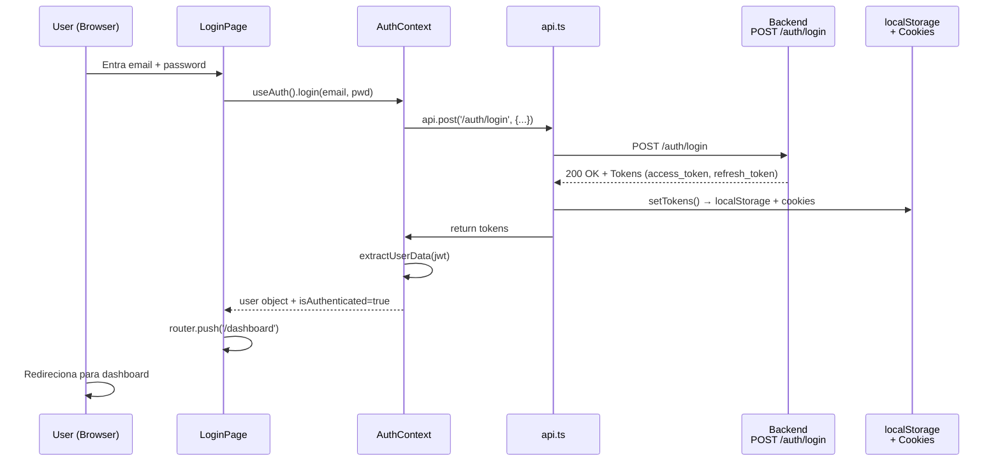

# 🏗️ Arquitetura do Ritmo Frontend

Visão geral completa da arquitetura, stack, e fluxos de dados do Next.js 14 SaaS.

## 📐 Arquitetura em Camadas

```
┌─────────────────────────────────────────────────────────────┐
│                    App Router (Next.js 14)                   │
│                  layout.tsx + providers.tsx                  │
├─────────────────────────────────────────────────────────────┤
│                    Pages & Layouts                           │
│  /login  /register  /dashboard  /admin  /demo  /terms        │
├─────────────────────────────────────────────────────────────┤
│                     React Components                         │
│  /components/ui/Button, Modal, ThemeToggle, WhatsAppModal   │
├─────────────────────────────────────────────────────────────┤
│                  Context Providers                           │
│  AuthProvider (JWT, user data)  |  ThemeProvider (light/dark)│
├─────────────────────────────────────────────────────────────┤
│                   Business Logic                            │
│  lib/api.ts  |  lib/auth-context.tsx  |  lib/uazapi.ts      │
├─────────────────────────────────────────────────────────────┤
│                   Backend APIs                              │
│  Ritmo Backend (localhost:8000)  |  UAZAPI (WhatsApp)       │
└─────────────────────────────────────────────────────────────┘
```

---

## 📂 Estrutura de Pastas

### `/app` - Next.js App Router

```
app/
├── (root pages)              # Páginas públicas
│   ├── page.tsx              # Landing page
│   ├── page.module.css       # Estilos landing (demo cards)
│   ├── login/page.tsx        # Login page
│   ├── register/page.tsx     # Sign-up page
│   ├── demo/page.tsx         # Interactive demo
│   ├── privacy-policy/       # Legal pages
│   ├── terms-of-service/     # Legal pages
│   └── forgot-password/      # Password reset
│
├── admin/                    # Protected: Admin panel
│   ├── layout.tsx            # Admin sidebar + nav
│   ├── page.tsx              # Dashboard
│   ├── tenants/              # Manage companies
│   ├── users/                # Manage users
│   └── settings/             # Admin settings
│
├── dashboard/                # Protected: User dashboard
│   ├── layout.tsx            # Dashboard layout
│   ├── page.tsx              # Overview
│   ├── schedule/             # Schedule management
│   ├── clients/              # Client management
│   ├── services/             # Service management
│   ├── team/                 # Team management
│   └── settings/             # User settings + WhatsApp
│
├── globals.css               # 🎨 Design tokens (CSS Variables)
├── layout.tsx                # Root layout + Providers
├── providers.tsx             # AuthProvider + ThemeProvider
└── favicon.ico
```

### `/components` - Componentes Reutilizáveis

```
components/
└── ui/                       # Componentes primitivos
    ├── Button/               # CTA button
    ├── Input/                # Text input + validation
    ├── Modal/                # Dialog modal + footer
    ├── ThemeToggle/          # Light/dark toggle
    ├── LoadingSpinner/       # Spinner + skeleton loader
    ├── WhatsAppModal/        # WhatsApp connection UI
    └── index.ts              # Barrel export
```

**Padrão de componente:**
```
Component/
├── Component.tsx             # Lógica + JSX
├── Component.module.css      # Estilos (CSS Modules)
└── index.ts                  # Export (ou apenas arquivo .tsx)
```

### `/lib` - Lógica Compartilhada

```
lib/
├── api.ts                    # ⭐ HTTP Client (core)
│   ├── apiRequest()          # Main request function
│   ├── setTokens/getTokens   # Token management
│   ├── refreshAccessToken()  # Auto-refresh on 401
│   └── handleApiError()      # Centralized error handling
│
├── auth-context.tsx          # 🔐 Auth Context (JWT)
│   ├── AuthProvider          # Wraps app
│   ├── useAuth()             # Hook para usar auth
│   ├── login()               # Email + password
│   ├── logout()              # Clear tokens
│   └── User type             # Type defs
│
├── theme-context.tsx         # 🎨 Theme Context (light/dark)
│   ├── ThemeProvider         # Wraps app
│   ├── useTheme()            # Hook para usar tema
│   ├── setTheme()            # light | dark | system
│   └── toggleTheme()         # Alterna tema
│
├── admin-api.ts              # Admin-specific API
│   ├── loginWithCredentials()
│   ├── adminRequest()        # HTTP + auth handling
│   ├── JWT vs Legacy token   # Dual auth support
│   └── adminApi object       # Convenience methods
│
├── uazapi.ts                 # 🔌 WhatsApp Client
│   ├── UazapiClient class    # Instance methods
│   ├── Connect/Disconnect    # QR code flow
│   ├── Webhook setup         # Event routing
│   ├── Send messages         # Text/media
│   └── WhatsAppStorage       # localStorage helpers
│
└── utils/                    # Shared utility functions (formatting, validation, etc)
```

---

## 🔄 Fluxos Principais

### 1️⃣ Fluxo de Autenticação (Login)



**ASCII Fallback:**
```
User Input (email + password)
    ↓
<LoginPage>.handleLogin()
    ↓
useAuth().login(email, password)
    ↓
api.post('/auth/login', { email, password }, { requiresAuth: false })
    ↓
[Backend: POST /auth/login → JWT response]
    ↓
setTokens(response)  // localStorage + cookies
    ↓
extractUserData(jwtPayload)
    ↓
setUser(userData)  // Update AuthContext
    ↓
useRouter.push('/dashboard')  // Redirect
```

**JWT Payload Example:**
```json
{
  "sub": "user-id-uuid",
  "tenant_id": "tenant-uuid",
  "email": "user@example.com",
  "name": "John Doe",
  "business_name": "Salão XYZ",
  "exp": 1705276800
}
```

### 2️⃣ Fluxo de Requisições API com Auto-Refresh

```
User clicks "Save"
    ↓
onClick handler → api.post('/endpoint', data)
    ↓
apiRequest() {
  ├─ Get access token from memory/localStorage
  ├─ Add 'Authorization: Bearer <token>' header
  ├─ Fetch request
  ├─ Response 401? → refreshAccessToken()
  │  └─ POST /auth/refresh → new access_token
  │  └─ Retry original request with new token
  └─ Return data or throw error
}
    ↓
Component uses response or shows error
```

**Error Handling:**
- **401**: Token expirado → tentar refresh → logout se falhar
- **403**: Sem permissão → mostrar aviso
- **404**: Recurso não existe
- **422**: Validação falhou → detalhar erro
- **500+**: Erro servidor → retry com backoff

### 3️⃣ Fluxo de Theme (Light/Dark)

```
User clicks theme toggle
    ↓
onClick → useTheme().toggleTheme()
    ↓
setTheme('light' | 'dark')
    ↓
Save to localStorage['ritmo_theme']
    ↓
Set document.documentElement.setAttribute('data-theme', theme)
    ↓
CSS responde via [data-theme="dark"] selector
    ↓
All colors update instantly (CSS Variables)
```

**CSS exemplo:**
```css
:root { --color-bg-primary: #ffffff; }
[data-theme="dark"] { --color-bg-primary: #1c1c1e; }

.component { background: var(--color-bg-primary); }
/* Muda automaticamente sem JS recompilation */
```

### 4️⃣ Fluxo de WhatsApp (UAZAPI)

```
User clicks "Conectar WhatsApp"
    ↓
<WhatsAppModal>.handleConnect()
    ↓
uazapi.createInstance(businessName, tenantId)  // Admin token
    ↓
uazapi.connect(instanceToken)  // Gera QR code ou link
    ↓
User scans QR / clica link
    ↓
[UAZAPI: WhatsApp device auth]
    ↓
WhatsAppStorage.saveToken(instanceToken)  // localStorage
    ↓
uazapi.setupDefaultWebhook(instanceToken)
    ↓
[Backend receives webhook events]
    ↓
Modal shows "Conectado ✓"
```

---

## 🎯 Roteamento (App Router)

### Rotas Públicas
- `GET /` → Landing + demo cards
- `GET /login` → Login form
- `GET /register` → Sign-up form
- `GET /demo` → Interactive demo page
- `GET /terms` → Terms of service
- `GET /privacy` → Privacy policy

### Rotas Protegidas (Requer Auth)
- `GET /dashboard` → User overview
- `GET /dashboard/schedule` → Agenda
- `GET /dashboard/settings` → User settings + WhatsApp
- `GET /admin` → Admin dashboard (requer role: admin)
- `GET /admin/tenants` → Manage companies
- `GET /admin/users` → Manage users

**Proteção (Middleware):**
`middleware.ts` (não mostrado) deve validar JWT em cookies antes de rotas `/dashboard` e `/admin`.

---

## 🔌 Integrações Externas

### Ritmo Backend
- **Base URL**: `NEXT_PUBLIC_RITMO_API_URL` (env)
- **Auth**: JWT Bearer token
- **Endpoints principais**:
  - `POST /auth/login`
  - `POST /auth/refresh`
  - `GET /user/me`
  - `POST /bookings` (criar agendamento)
  - `GET /schedule` (listar agenda)

### UAZAPI (WhatsApp)
- **Integração no dashboard**: via backend Ritmo (`/api/v1/uazapi/*`)
- **Admin Token**: `UAZAPI_ADMIN_TOKEN` (env, apenas backend)
- **Webhook Auth**: token `connection` por tenant na URL de webhook
- **Endpoints principais**:
  - `POST /api/v1/uazapi/instance/init` (criar instância)
  - `POST /api/v1/uazapi/instance/connect` (gerar QR)
  - `GET /api/v1/uazapi/instance/status` (status/QR)
  - `POST /api/v1/uazapi/webhook` (configurar webhook)

---

## 🧠 Estado da Aplicação

### AuthContext
```tsx
interface User {
  id: string;
  email: string;
  name: string;
  tenant_id: string;
  business_name?: string;
}

interface AuthContextType {
  user: User | null;
  isLoading: boolean;
  error: string | null;
  login(email, password): Promise<void>;
  logout(): void;
  isAuthenticated(): boolean;
}
```

**Como usar:**
```tsx
const { user, isAuthenticated, login, logout } = useAuth();

if (!isAuthenticated) {
  return <Redirect to="/login" />;
}

return <div>Olá, {user.name}!</div>;
```

### ThemeContext
```tsx
type Theme = 'light' | 'dark' | 'system';

interface ThemeContextType {
  theme: Theme;
  resolvedTheme: 'light' | 'dark';  // Computed
  setTheme(theme: Theme): void;
  toggleTheme(): void;
  mounted: boolean;  // Hydration-safe
}
```

**Como usar:**
```tsx
const { theme, resolvedTheme, setTheme } = useTheme();

return (
  <button onClick={() => setTheme(theme === 'light' ? 'dark' : 'light')}>
    {resolvedTheme === 'light' ? '☀️' : '🌙'}
  </button>
);
```

---

## 🔐 Segurança

### Token Storage
- **Access Token**: 
  - localStorage (hydration + client-side)
  - Cookie com flag `SameSite=Lax` (CSRF + middleware)
  - Expira em ~1 hora
  
- **Refresh Token**:
  - localStorage
  - Cookie com flag `SameSite=Lax`
  - Expira em ~7 dias

### CORS & HTTPS
- Backend deve enviar `Access-Control-Allow-Origin: <frontend-url>`
- Em produção, FORCE HTTPS via `next.config.js`
- Cookies require `Secure` flag (HTTPS only)

### Tenant Isolation
- Tenant ID vem do JWT (backend-controlled)
- Nunca manipular `tenant_id` no frontend
- API calls são filtradas por tenant automaticamente

---

## 📊 Diagrama de Estado Global

```
App (root layout)
  ↓
Providers (app/providers.tsx)
  ├─→ ThemeProvider
  │    ├─ State: theme, resolvedTheme, mounted
  │    └─ Actions: setTheme(), toggleTheme()
  │
  └─→ AuthProvider
       ├─ State: user, isLoading, error
       ├─ Actions: login(), logout()
       └─ API: setTokens(), clearTokens(), isAuthenticated()
             ↓
       [Child components can useAuth() + useTheme()]
```

---

## 🎨 Design System Foundation

**Arquivo principal:** `app/globals.css`

Contains:
- 100+ CSS Variables (colors, spacing, typography, shadows)
- Dark mode via `[data-theme="dark"]` selector
- macOS-inspired design (rounded, subtle shadows, clear hierarchy)
- Mobile-first responsive design

**Aplicado em:**
- Componentes via CSS Modules: `className={styles.button}`
- Inline styles: `style={{ color: 'var(--color-accent)' }}`
- CSS Grid/Flex: `gap: var(--space-4)`

---

## 📈 Performance Considerations

1. **Code Splitting**: Next.js 14 auto-splits routes
2. **Lazy Loading**: `next/dynamic` para componentes pesados
3. **Image Optimization**: Usar `next/image`
4. **CSS-in-JS**: CSS Modules evita style injection overhead
5. **API Caching**: SWR com `revalidateOnFocus: false` para dados não-críticos
6. **Token Refresh**: Async, non-blocking (background)

---

## 🔮 Evoluções Futuras

- [ ] Testes E2E (Playwright/Cypress)
- [ ] Monitoramento com Sentry/LogRocket
- [ ] Analytics com Segment/Mixpanel
- [ ] Feature flags (LaunchDarkly/Unleash)
- [ ] Offline support (Service Workers)
- [ ] Progressive Web App (PWA)
- [ ] Streaming SSR (React 18.2+)

---

**Próximas:** [Development Setup](../development/setup.md) | [API Client Guide](../api/client.md)
